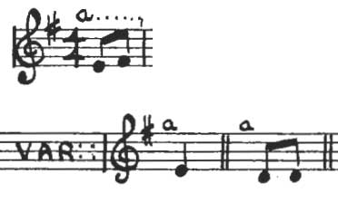
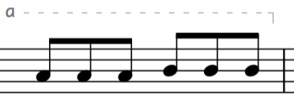
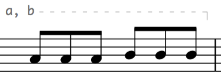
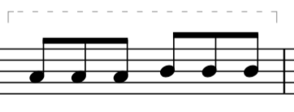
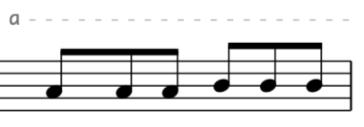
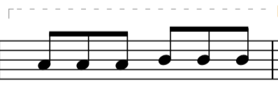
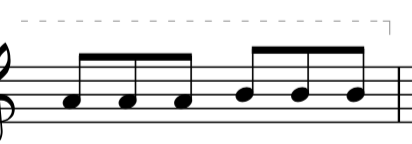
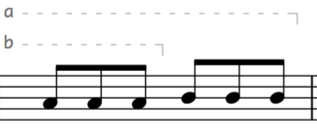
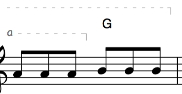

# bayard-variations

These [abcm2ps](http://moinejf.free.fr/) "decos" add support for above the staff variation-marking notation to [abc](http://abcnotation.com/).

For years in my fiddle transcriptions I marked variations with a superscripted letter (in abc, this was `"^a..."`). Finally I came across that exact idea in print in Jeff Todd Titon's [*Old Time Kentucky Fiddle Tunes*](http://www.kentuckypress.com/live/title_detail.php?titleid=1074#.V-Mch5MrKHo). Titon says he "and other scholars" trace the idea back to [Samuel Bayard](https://en.wikipedia.org/wiki/Samuel_Preston_Bayard), in his 1944 *Hill Country Tunes: Instrumental Folk Music of Southwestern Pennsylvania*. Bayard's notation was actually nicer, as it showed exactly which notes were varied (my crop):



After I'd been working on PostScript decorations to emulate Bayard for a while, Beáta Salamon's [*Magyar népzenei dallamgyűjtemény*](http://www.hagyomanyokhaza.hu/page/716/) came out… and what did I find in it but beautiful Bayard-type variation notation. The **bayard-variations** are my own expansion on Bayard and Salamon's ideas.

##USAGE

1. ###var-x
 
	```
	!var-x(! y0 AAA BBB !var-x)!
	```
 prints `x-------,` over the notes AAA BBB
 
 <kbd></kbd>
 
1. ###var-xy
 
	```
	!var-xy(! y0 AAA BBB !var-xy)!
	```
 prints `x, y----,` over the notes and so on for `var-xyz`, `var-xyz1`, and `var-xyz12`
 
 <kbd></kbd>
 
1. ###var
	```
	!var(! y0 AAA BBB !var)!
	```
 prints `,-------,` over the notes
 
 <kbd></kbd>
 
1. ###varcontinues-x
	```
	!varcontinues-x(! y0 AAA BBB !varcontinues-x)!
	```
 prints `x---------` over the notes (e.g. for use when a variation extends beyond the end of a staff). *varcontinues-x is intended to pair with varcontinued*
 
 <kbd></kbd>
 
1. ###varcontinues
	```
	!varcontinues(! y0 AAA BBB !varcontinues)!
	```
 prints `,---------` over the notes (e.g. for use when a variation extends beyond the end of a staff). *varcontinues is intended to pair with varcontinued*
 
 <kbd></kbd>
 
1. ###varcontinued
	```
	!varcontinued(! y0 AAA BBB !varcontinued)!
	```
 prints `--------,` over the notes (e.g. for use when a variation started before the current staff. *varcontinued is intended to pair with either varcontinues-x or varcontinues*
 
 <kbd></kbd>

 --
 
 ####Those decorations don't stack nicely. If you need to mark overlapping variations:

1. ###var-x\_stack

	```
	!var-x_stack! !var-y_stack! y0 AAA !var-y_stack)! BBB !var-x_stack)!
	```
  prints `y----,` over `AAA` and, above that, `x---------,` over `AAA BBB`
 
 <kbd></kbd>
  
1. ###varcont\_stack
	```
	!varcont_stack(! !var-x_stack! AAA !var-x_stack)! BBB !varcont_stack)!
	```
 prints `x----,` over `AAA` and, over that, prints `-----------,` over `AAA BBB`
 
 <kbd></kbd>


Note: **guitar chords** (in `"quotations"`) **don't look good with stacked variation
markers. Use the included `hbv-deco-chords.fmt` to get around this** - include
that .fmt and replace any

	!var..._stack(! y0 "X" ... !var..._stack)!
	
with
 
	!var..._stack(! y0 !X! y0 ... !var..._stack)!

I recommend always putting a `y0` after the opening deco of a long decoration,
e.g. after `!var-x(!`. It's sometimes a good idea to put one after the closing
deco `!var-x)!` and, in the case of variation markers stacked above guitar chords, after the `!X!` stackable guitar deco.


##CUSTOMIZATION

I use Monaco 9 for the label and a thin 60%-black dashed line

-	The font is defined before every occurrence of the postscript command `show`
-	The thickness of the line is defined before every `SLW` (abcm2ps shorthand for
	the postscript command `setlinewidth`) (default: 0.5)
-	The darkness of the line is defined before every non-zero `setgray` (default: 0.6)
-	The dash is defined before every non-`[]` `setdash` (default: [3 5], which is 3px
	of line followed by 5px of space)

The line could be made e.g. solid and black by commenting out all `setdash` and `setgray`


##CONTENTS

I've included a lot of decorations, which should cover most needs:

- single-letter variables `var-a` to `var-z`
- single-number variables `var-0` to `var-9`
- an asterisk variable `var-*`
- two-letter variables `var-ab` to `var-yz` for sequential pairs (e.g. `var-bc`, not `var-ac`)
- assorted other two-letter variables I've needed
- three-letter variables `var-abc` to `var-klm` (again, in sequential triplets)
- assorted other three-letter variables I've needed
- the four-letter variable `var-abcd`
- the five-letter variable `var-abcde`
- single-letter open-ended variables `varcontinues-a` to `varcontinues-f`
- the unnamed variable `var`
- the open-ended unnamed variable `varcontinues`
- the open-start variable `varcontinued`
- single-letter \_stackable variables `var-a_stack` to `var-z_stack`
- single-number \_stackable variables `var-1_stack` to `var-3_stack`
- \_stackable unnamed open-ended variable `varcons_stack`
- \_stackable open-start variable `varcont_stack`

If that doesn't meet your needs, design your own:

##DESIGN

You'll need to add three lines per decoration, within `beginps...endps`:

	/var-[name]{/varname ([marker text] def [1var/[2-5]vars]}!
	deco var-[name]( [5 for normal, 7 for stacking] - 17 0 0
	deco var-[name]) ["] var-[name] 17 0 0


One-Character Example: `var-a`

	/var-a{/varname (a) def 1var}!
	deco var-a( 5 - 17 0 0
	deco var-a) 5 var-a 17 0 0

Two-Character Example: `var-ab`

	/var-a{/varname (a, b) def 2vars}!
	deco var-ab( 5 - 17 0 0
	deco var-ab) 5 var-ab 17 0 0

Three-Character Example: `var-abc`

	/var-abc{/varname (a, b, c) def 3vars}!
	deco var-abc( 5 - 17 0 0
	deco var-abc) 5 var-abc 17 0 0

Four-Character Example: `var-abcd`

	/var-abcd{/varname(a, b, c, d) def 4vars}!
	deco var-abcd( 5 - 17 0 0
	deco var-abcd) 5 var-abc 17 0 0

Five-Character Example: `var-abcde`

	/var-abcde{/varname (a, b, c, d, e) def 5vars}!
	deco var-abcde( 5 - 17 0 0
	deco var-abcde) 5 var-abcde 17 0 0

Custom Example: `var-custom`

	/var-custom{/varname (a. bc!!) def 3vars}!
	deco var-custom( 5 - 17 0 0
	deco var-custom) 5 var-custom 17 0 0

Custom \_stackable Example: `var-custom2`

	/var-custom_stack{/varname (a. bc!!) def 3vars}!
	deco var-custom_stack( 7 - 17 0 0
	deco var-custom_stack) 7 var-custom_stack 17 0 0

Note, **for custom variables, that by default your marker text can be one, four
seven, ten, or thirteen characters** long (using 1var, 2vars, 3vars, 4vars, and
5vars, respectively). For marker text of other lengths you'll need to customize the
variable `<adjust>`, which determines the horizontal placement of the marker line's start.


##ARCHITECTURE

Here's the logic

1. Named, bracketing at end  
&emsp;deco `var-[x[y[z[1[2]]]]][_stack](`  
&emsp;and  
&emsp;deco `var-[x[y[z[1[2]]]]][_stack])`  
&emsp;&emsp;refer to  
&emsp;&emsp;`/var-x`  
&emsp;&emsp;&emsp;refers to  
&emsp;&emsp;&emsp;`/[#]vars`  
&emsp;&emsp;&emsp;&emsp;refers to  
&emsp;&emsp;&emsp;&emsp;`/variation`

1. Unnamed, bracketing at start and end  
&emsp;deco `var(`  
&emsp;&emsp;refers to  
&emsp;&emsp;`\unnamedvar`

1. Open, named, extending a little further right than the default  
&emsp;deco `varcontinues-[x[y[z[1[2]]]]](`  
&emsp;and  
&emsp;deco `varcontinues-[x[y[z[1[2]]]]])`  
&emsp;&emsp;refer to  
&emsp;&emsp;`/varconts-a`  
&emsp;&emsp;&emsp;refers to  
&emsp;&emsp;&emsp;`/1contvar`

1. Open, unnamed, extending a little further right than the default  
&emsp;deco `varcontinues(`  
&emsp;and  
&emsp;deco `varcontinues)`  
&emsp;&emsp;refer to  
&emsp;&emsp;`/varcontsunnamed`

1. Open at left, extending a little further left than the default  
&emsp;deco `varcontinued(`  
&emsp;and  
&emsp;deco `varcontinued)`  
&emsp;and  
&emsp;deco `varcont_stack(`  
&emsp;and  
&emsp;deco `varcont_stack)`  
&emsp;&emsp;refer to  
&emsp;&emsp;`/varcontd`